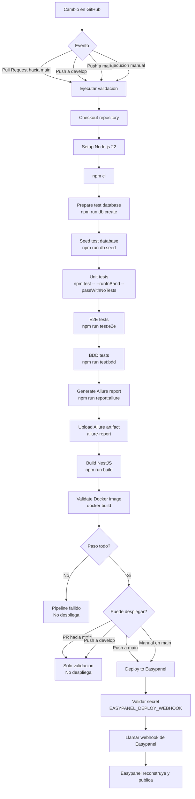
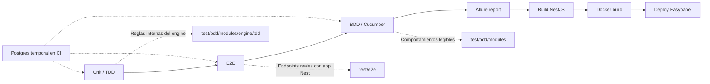

# GitHub Actions CI/CD Flow

Este esquema resume el flujo definido en `.github/workflows/ci-cd.yml`.

## Lectura Rapida

| Caso | Que ejecuta | Despliega |
| --- | --- | --- |
| Pull Request hacia `main` | Tests, build y Docker build | No |
| Push a `develop` | Tests, build y Docker build | No |
| Push a `main` | Tests, build, Docker build y webhook | Si |
| Ejecucion manual en `main` | Tests, build, Docker build y webhook | Si |

## Capas De Pruebas

## Regla Principal

El deploy a Easypanel solo ocurre cuando todo esto pasa correctamente:

1. Preparacion de la base temporal de pruebas.
2. Carga de datos semilla.
3. Tests unitarios/TDD.
4. Tests E2E.
5. Tests BDD.
6. Generacion y subida del reporte Allure como artifact.
7. Build de NestJS.
8. Construccion de Docker.
9. Existencia del secret `EASYPANEL_DEPLOY_WEBHOOK`.

Si una parte falla, GitHub Actions detiene el flujo y no llama a Easypanel.
