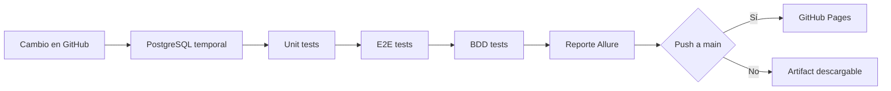
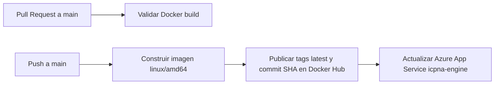

# GitHub Actions flows

Los workflows de pruebas y despliegue de Erixcel Engine están aislados.

## Pruebas

El workflow `.github/workflows/tests.yml` se ejecuta en Pull Requests hacia
`main`, pushes a `main` y `develop`, y manualmente.

Este workflow no construye ni publica imágenes Docker y no realiza despliegues.

## Docker y Azure

El workflow `.github/workflows/deploy-azure.yml` usa la imagen
`${DOCKERHUB_USERNAME}/icpna-engine`.

Secrets requeridos en GitHub:

- `DOCKERHUB_USERNAME`
- `DOCKERHUB_TOKEN`
- `AZURE_WEBAPP_PUBLISH_PROFILE`

Easypanel ya no forma parte del CI/CD del proyecto.
